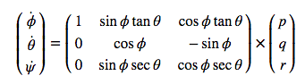
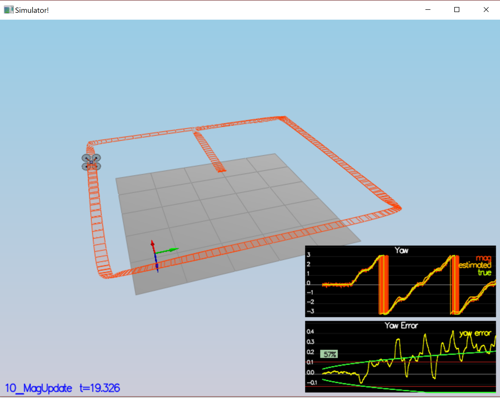
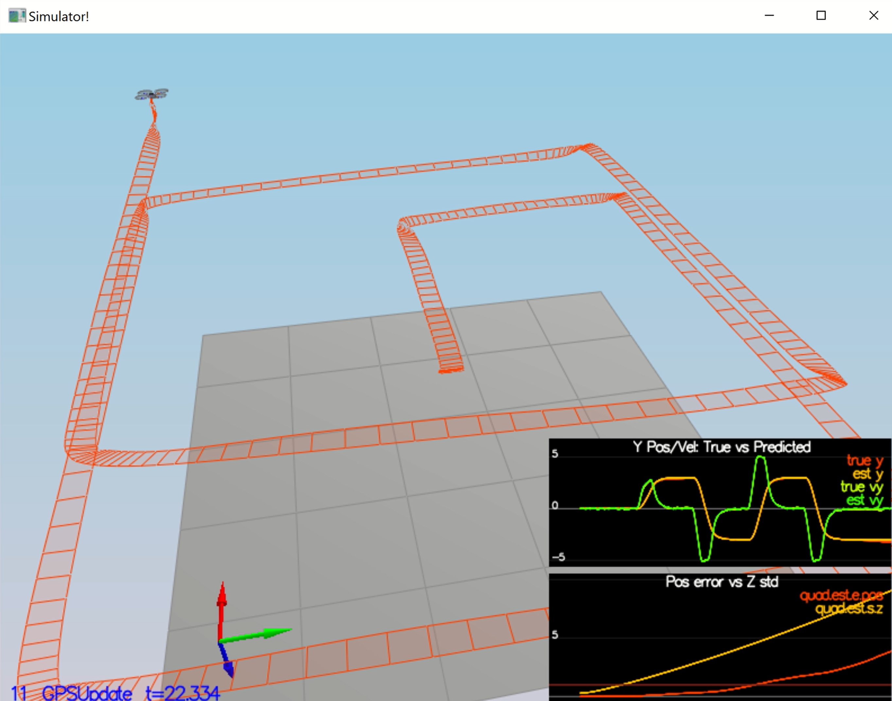
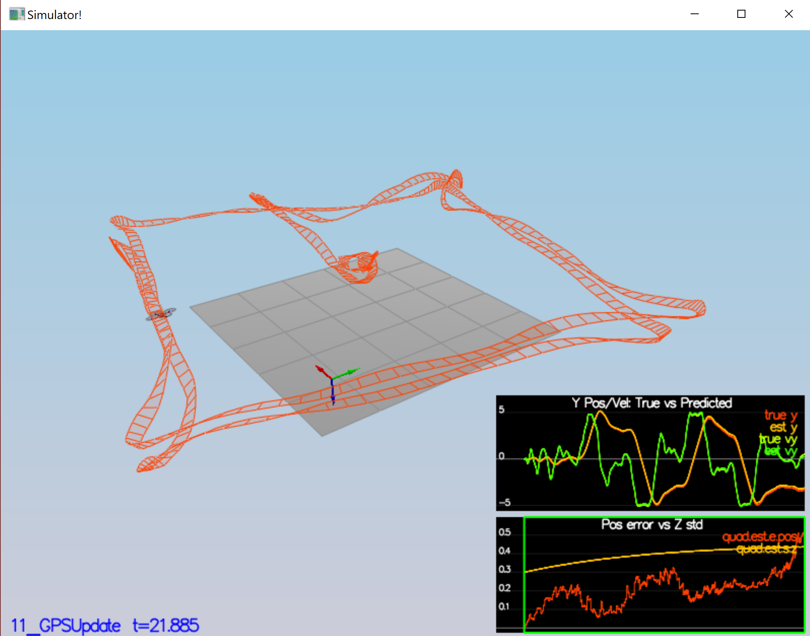

# Estimation Project #

Udacity Flying Car Nanodegree - 3D Quadrotor Estimation

This README is broken down into the following sections:

This is the last project in this program in which the students had to implement the Extended Kalman Filter (EKF) method on top of the previously written control project. 
In this project, we comibned a nosiy GPS, IMU, and a magnetgometer (compass) to estimate current drone position, velocity, and yaw. The EKF algorithm was adopted based on a research work by Tellex *et al.* ([Estimation for Quadrotors](https://www.overleaf.com/read/vymfngphcccj)) and was implemented in C++.


## Project Structure ##

In order to test the EKF implementation, six scenarios were given as follows: 


### Step 1: Sensor noise ###

For the controls project, the simulator was working with a perfect set of sensors, meaning none of the sensors had any noise.  The first step to adding additional realism to the problem, and developing an estimator, is adding noise to the quad's sensors.  For the first step, students had to collect some simulated noisy sensor data and estimate the standard deviation of the quad's sensor.

``` 
Success criteria : Your standard deviations should accurately capture the value of approximately 68% of the respective  measurements.
```

[](http://www.youtube.com/watch?v=t5pnEl3ADYQ)

The output:
```
Simulation #3 (../config/06_SensorNoise.txt)
FAIL: ABS(Quad.GPS.X-Quad.Pos.X) was less than MeasuredStdDev_GPSPosXY for 50% of the time
FAIL: ABS(Quad.IMU.AX-0.000000) was less than MeasuredStdDev_AccelXY for 63% of the time
```


### Step 2: Attitude Estimation ###

In this step, information (pqr body rates) measured by IMU was converted into drone state variables. The pqr measurements from gyroscope  in body coordinates was transformed to interia coordinates. The rotation matrix used in this transformation is given below: 



In this step, the measurements from compass (magnetometer) was used to improve the filter's performance in estimating the drone's heading. 


``` 
Success criteria: Your attitude estimator needs to get within 0.1 rad for each of the Euler angles for at least 3 seconds.
```

[](http://www.youtube.com/watch?v=T3tP0GtM-54)

The output:
```
Simulation #2 (../config/07_AttitudeEstimation.txt)
PASS: ABS(Quad.Est.E.MaxEuler) was less than 0.100000 for at least 3.000000 seconds
```


### Step 3: Prediction Step ###

In the first section of this step, a perfect IMU (only an IMU) was considered for a square path. Due to the sensitivity of double-integration to attitude errors, the accelerator update very was made insignificant (QuadEstimatorEKF.attitudeTau = 100). Without any implementation the estimated state did not follow the true state. 

In the second part, the `PredictState()` functon was completed. Now, the estimator track the actual state. It can be seen that a small drift was introduced into our estimation.

[](http://www.youtube.com/watch?v=qOHcynYL6ws)

In the third part of this step, a realistic IMU with noise was introduced. Therefor to complete `QuadEstimatorEKF.cpp`, the partial derivative of the body-to-global rotation matrix was implemented in the function `GetRbgPrime()`. Afterwards, to predict the state covariance forward the `Predict()` function was implemented. 

[](http://www.youtube.com/watch?v=ZO-W05fa0V0)


### Step 4: Magnetometer Update ###


In this step, the measurements from magnetometer (compass) was used to improve the filter's performance in estimating the drone's heading. 

First, scenario `10_MagUpdate` was run with implementing any magnetometer update (Figure shown below). Naturally, the estimated yaw will not be close to the real value and will drift. 



By tuning `QYawStd` (`QuadEstimatorEKF.txt`) in the QuadEstimatorEKF, the approximate drift of scenario 10 without implementation was reproduced. In the next step, function `UpdateFromMag()` was completed, and the following video and output show a satisfactory estimation of yaw. 

[](http://www.youtube.com/watch?v=U2tYeIxM_SI)

Simulation #2 (../config/10_MagUpdate.txt)
PASS: ABS(Quad.Est.E.Yaw) was less than 0.120000 for at least 10.000000 seconds
PASS: ABS(Quad.Est.E.Yaw-0.000000) was less than Quad.Est.S.Yaw for 81% of the time


### Step 5: Closed Loop + GPS Update ###

The purpose of this step is to incorporate the measurements of GPS in our state estimation.

In the first part, the vehicle was run without having an ideal estimator built-in while having an ideal IMU, and as it can be seen the vehicle's state could not captured perfectly.



The process noise model were estimated and entered in (`QuadEstimatorEKF.txt`) to try to approximately capture the error seen. In the next, step function `UpdateFromGPS()` was completed and it can be seen that the position estimation were satisfactory close to the real values according to the criteria. 

```
Success criteria: Your objective is to complete the entire simulation cycle with estimated position error of < 1m.
```
[](http://www.youtube.com/watch?v=U9Zmz6IMtJM)

```
Simulation #2 (../config/11_GPSUpdate.txt)
PASS: ABS(Quad.Est.E.Pos) was less than 1.000000 for at least 20.000000 seconds
```

### Step 6: Adding Your Controller ###

In this last step, we were asked to replace the given control function and parameters with the ones implemented in the last project. 
The purpose of this step is to check if EKF implemention is flexible enough to work with the actual control systems. 

The loop trajectory with mine previously written control function and parameter was found as follows:



After tuning new control parameters as provided in [/config/QuadControlParams.txt](./config/QuadControlParams.txt), the estimator could successfully estimate the state of the vehicle as it shown below.

```
Success criteria: Your objective is to complete the entire simulation cycle with estimated position error of < 1m.
```
```
Simulation #8 (../config/11_GPSUpdate.txt)
PASS: ABS(Quad.Est.E.Pos) was less than 1.000000 for at least 20.000000 seconds
```

[](http://www.youtube.com/watch?v=q5z7XC0UD5Q)
